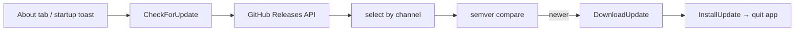

# Desktop updates

The app polls GitHub Releases for newer **`v*`** tags (ignores `ext-v*`). Stable channel = latest non-prerelease; beta = latest prerelease.

Same channel rules as the web site — `packages/shared/src/releases.ts`.

## Flow

## States

`idle` → `checking` → `up_to_date` | `available` → `downloading` → `ready` → install quits the app.

Errors land in `updateInfo.error`; user can retry from About.

## Channels

| Channel | Picks                                         |
| ------- | --------------------------------------------- |
| stable  | Newest `v*` release where `prerelease: false` |
| beta    | Newest `v*` release where `prerelease: true`  |

Toggle in About → saved in settings.

## Install per OS

- **Windows** — run downloaded installer or replace portable `.exe`
- **macOS** — replace app in Applications
- **Linux AppImage** — helper script copies new image after the app exits
- **Linux tarball** — opens release page (manual)

## Where in the code

| File                                        | Role                   |
| ------------------------------------------- | ---------------------- |
| `internal/infra/updater/updater.go`         | API, download, install |
| `internal/app/app.go`                       | Wails surface          |
| `frontend/.../UpdateCard.tsx`               | About UI               |
| `frontend/.../use-startup-update-check.tsx` | One check after launch |

Cutting a release: [[Architecture-Releases-and-CI]].
