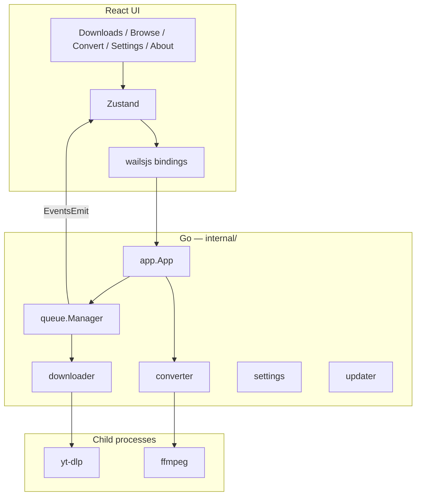
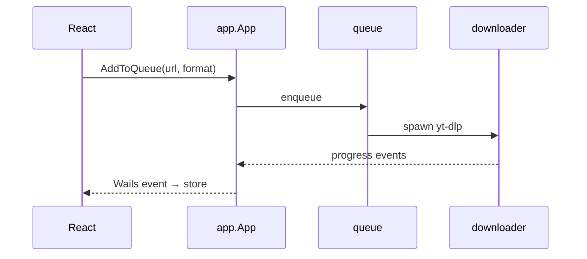

# Desktop app

Wails v2 app: Go backend in `internal/`, React UI in `frontend/`. The Go binary embeds `frontend/dist`.

## Stack



## Layers

| Layer    | Path              | Does                                                |
| -------- | ----------------- | --------------------------------------------------- |
| Frontend | `frontend/src/`   | UI, i18n, calls Go via Wails                        |
| App      | `internal/app/`   | Wails methods, deep links, wires infra together     |
| Core     | `internal/core/`  | Types, interfaces, settings model                   |
| Infra    | `internal/infra/` | Queue, yt-dlp, FFmpeg, filesystem, updater, logging |

## Download flow



Default engine is **yt-dlp** (auto-downloaded). Legacy **kkdai/youtube** is still available in settings. **FFmpeg** is fetched on demand for conversion.

Parallel download count comes from settings; the queue manager enforces it.

## Talking to the frontend

- **Sync:** generated bindings in `frontend/wailsjs/go/` — settings, queue, update check, etc.
- **Async:** `runtime.EventsEmit` — download progress, deep-link results, converter status.

## Deep links

Single-instance app. A `ybdownloader://add?url=…&format=…` link focuses the window and enqueues the video. Platform-specific routing is in [[Architecture-Extension-Deep-Links]].

## Build

```bash
pnpm dev:desktop          # hot reload
pnpm build:desktop        # wails build → apps/desktop/build/bin/
```

Version is injected at link time: `-X main.Version=…`. Packaging notes: [apps/desktop/build/README](https://github.com/teofanis/ybdownloader/blob/main/apps/desktop/build/README.md).

Updates: [[Architecture-Desktop-Updates]]. Releases: [[Architecture-Releases-and-CI]].
