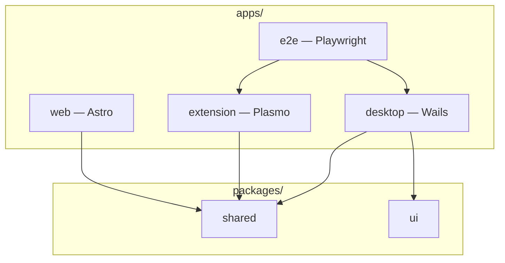

# Monorepo

pnpm workspace + Turborepo. One repo, four apps, a few shared packages.



## Apps

| App       | Ships as                            | Tag / deploy                  |
| --------- | ----------------------------------- | ----------------------------- |
| Desktop   | `.exe`, `.dmg`, AppImage, `.tar.gz` | `v*`                          |
| Extension | Chrome + Firefox zips               | `ext-v*`                      |
| Web       | Static `dist/` on Cloudflare Pages  | push `main` or GitHub Release |
| E2E       | Nothing — CI only                   | —                             |

## Shared packages

- **`@ybdownload/shared`** — GitHub URLs, release tag rules (`v*` vs `ext-v*`), deep links, markdown helpers. Used by web, extension, and desktop UI.
- **`@ybdownload/ui`** — shadcn components for the desktop app.
- **`@ybdownload/tsconfig`** — shared TS config.

Tag filtering lives in `packages/shared/src/releases.ts`. Web build, desktop updater, and changelog pages all use it — change it once, check all three.

## Dev commands

```bash
./scripts/setup-dev.sh   # first clone
pnpm dev:desktop
pnpm dev:extension
pnpm dev:web
pnpm test
pnpm e2e
```

## CI (short version)

| Workflow                | When                        | What                                             |
| ----------------------- | --------------------------- | ------------------------------------------------ |
| `ci.yml`                | Every PR                    | Go + TS lint/test                                |
| `release.yml`           | `v*` tag                    | E2E regression → desktop builds → GitHub Release |
| `extension-release.yml` | `ext-v*` tag                | Extension zips → GitHub Release                  |
| `web.yml`               | Web paths, `main`, releases | Lint, test, build, Cloudflare deploy             |

Details: [[Architecture-Releases-and-CI]]. E2E layout: [apps/e2e/README](https://github.com/teofanis/ybdownloader/blob/main/apps/e2e/README.md).

## What's not in this wiki

Per-app build steps, env vars, and packaging notes stay in each app's README. This wiki is only the cross-cutting "how does it connect" stuff.
