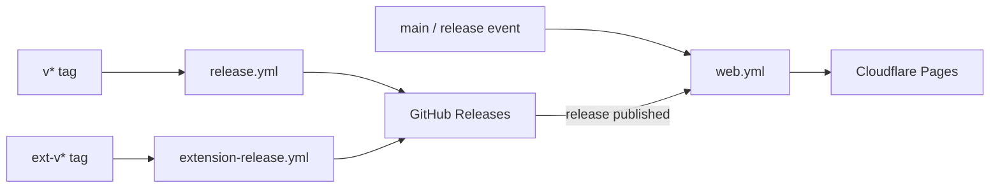

# Releases & CI

Three separate shipping paths. They share GitHub Releases as the download host but use different tags.

## Desktop (`v*`)

1. Push tag `v1.2.3`
2. `release.yml` runs E2E regression (Playwright)
3. Parallel builds: Linux, macOS, Windows
4. `action-gh-release` uploads assets + changelog
5. Triggers web production deploy

Artifacts: installer, portable exe, dmg, AppImage, tarball. See release body template in `release.yml` for the full list.

**Who reads this:** in-app updater, web site build, users on the Releases page.

## Extension (`ext-v*`)

1. Push tag `ext-v1.0.0`
2. `extension-release.yml` bumps version, runs `package-extension-release.sh`
3. Publishes Chrome + Firefox zips to GitHub Releases

Extension version is independent of desktop (`ext-v1.0.0` alongside `v1.0.5` is normal).

## Web

`web.yml`: lint → unit test → `astro build` → Playwright (`@web`) + Lighthouse (mobile lab CWV) → Cloudflare Pages.

| Trigger                  | Deploy?               |
| ------------------------ | --------------------- |
| PR (web paths)           | Preview URL on the PR |
| `main`                   | Production            |
| GitHub Release published | Production            |
| `workflow_dispatch`      | Production            |
| `develop`                | Build only            |

Set `WEB_DEPLOY_ENABLED=false` to turn off deploys without killing CI.

## Tag rules

| Pattern             | Product   |
| ------------------- | --------- |
| `v*` (not `ext-v*`) | Desktop   |
| `ext-v*`            | Extension |

Logic in `packages/shared/src/releases.ts`.

## PR CI (`ci.yml`)

Go lint/test, desktop UI vitest, extension lint, shared package tests. E2E smoke on PRs; desktop `@full` + marketing **production smoke** (Playwright + Lighthouse, warn-only) nightly; full regression only gates desktop **releases**.

E2E details: [apps/e2e/README](https://github.com/teofanis/ybdownloader/blob/main/apps/e2e/README.md).

## Related pages

- [[Architecture-Web]] — what the web deploy picks up
- [[Architecture-Desktop-Updates]] — how the app consumes `v*` releases
- [[Architecture-Extension-Deep-Links]] — extension zip install
