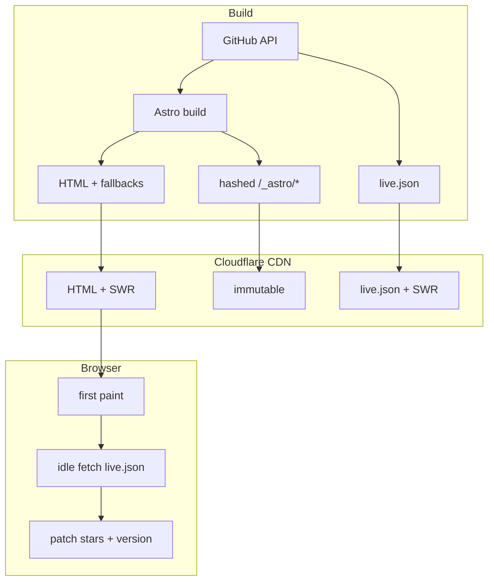

# Marketing site

Static Astro site at `apps/web`. Built in CI, served from Cloudflare Pages. No server at runtime.

Live site: [ybdownload.pages.dev](https://ybdownload.pages.dev)

## How it works



Most content is baked into HTML at build time (GitHub Releases API). Only star count and the version badge also refresh client-side via a small `live.json` file — so the site stays fast between deploys without going dynamic.

## Routes

| Route                         | Built from               | Refreshes                             |
| ----------------------------- | ------------------------ | ------------------------------------- |
| `/`, `/download`              | GitHub API + static copy | Deploy + `live.json` between deploys  |
| `/changelog`, `/releases`     | Full release lists       | Deploy only (too big for `live.json`) |
| `/extension`, `/app`, `/docs` | Static markdown/data     | Deploy on `main`                      |

## `live.json`

Generated at build (`astro:build:done`). Patched in the browser after paint via `data-live-*` hooks:

- `[data-live-stars]` — star badge
- `[data-live-cta="download"]` — "Download v…" buttons
- `[data-live-title="desktop"]` — download page title

HTML always has fallback values (works without JS).

## Cache headers (`public/_headers`)

Copied to `dist/` on build. Cloudflare Pages applies them on deploy — no extra dashboard config.

```
/_astro/*   immutable, 1 year
/live.json  10 min fresh, 48h stale-while-revalidate
/*          browser 1h, CDN 24h (s-maxage), 30d stale-while-revalidate
```

## Deploys (`web.yml`)

Production: push to `main` (web paths), publish a GitHub Release, or `workflow_dispatch`. PRs get a Cloudflare preview URL.

Publishing a desktop/extension release also triggers a web rebuild so changelog and download links stay current.

## Files worth knowing

| File                            | What                          |
| ------------------------------- | ----------------------------- |
| `src/lib/github.ts`             | Fetch releases/stars at build |
| `src/lib/generate-live-json.ts` | Write `dist/live.json`        |
| `src/lib/live-client.ts`        | Browser fetch + patch         |
| `public/_headers`               | CDN cache rules               |
| `.github/workflows/web.yml`     | CI/CD                         |

Run/build: [apps/web/README](https://github.com/teofanis/ybdownloader/blob/main/apps/web/README.md).

Releases: [[Architecture-Releases-and-CI]].
